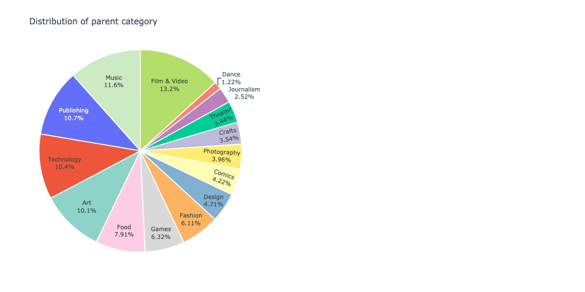

```{r setup, include=FALSE}
library(reticulate)
use_python("/usr/local/bin/python3")
#py_install("warnings")
```


```{python}
import pandas as pd
import numpy as np
import matplotlib.pyplot as plt
import matplotlib.colors
import geopandas as gpd
import seaborn as sns
import warnings
import pycountry
import plotly.graph_objs as go
from plotly import tools
import plotly.express as px
from plotly.subplots import make_subplots

sns.set_style("whitegrid")
color = sns.color_palette()

warnings.filterwarnings('ignore')
```

```{python}
Kickstarter = pd.read_csv("Cleaned_Kickstarter.csv")

Kickstarter[Kickstarter.country_displayable_name == "the United States"]["country_displayable_name"] = "United States of America"
Kickstarter[Kickstarter.country_displayable_name == "the United Kingdom"]["country_displayable_name"]  = "United Kingdom"
Kickstarter[Kickstarter.country_displayable_name == "the Netherlands"]["country_displayable_name"]  = "Netherlands"

# geographic 
Kickstarter_map = Kickstarter.groupby(["country_displayable_name", "country"])['blurb'].agg(['count'])
Kickstarter_map = Kickstarter_map.reset_index()

def alpha3code(column):
    CODE=[]
    for country in column:
        try:
            if country == "United States of America":
                CODE.append("USA")
            elif country == "the United Kingdom":
                CODE.append("GBR")
            else:
                code = pycountry.countries.get(name=country).alpha_3
                CODE.append(code)
        except:
            CODE.append('None')
    return CODE

Kickstarter_map['CODE'] = alpha3code(Kickstarter_map.country_displayable_name)

world = gpd.read_file(gpd.datasets.get_path('naturalearth_lowres'))
world.columns=['pop_est', 'continent', 'name', 'CODE', 'gdp_md_est', 'geometry']
Kickstarter_map_merge = pd.merge(world, Kickstarter_map, on='CODE', how = "left")

location=pd.read_csv('https://raw.githubusercontent.com/melanieshi0120/COVID-19_global_time_series_panel_data/master/data/countries_latitude_longitude.csv')
Kickstarter_map_merge = Kickstarter_map_merge.merge(location,on='name')

Kickstarter_state_map = Kickstarter[Kickstarter.location_country == "US"].groupby(["location_country", "location_state"])['blurb'].agg(['count'])
Kickstarter_state_map = Kickstarter_state_map.reset_index()

geo_usa = gpd.read_file('maps/cb_2018_us_state_20m.shp')
geo_usa = geo_usa[geo_usa.NAME != "Hawaii"]
geo_usa = geo_usa[geo_usa.NAME != "Alaska"]
geo_usa = geo_usa[geo_usa.NAME != "Puerto Rico"]
Kickstarter_state_map = geo_usa.merge(Kickstarter_state_map, how = "left", left_on='STUSPS', right_on = "location_state")

# Time
df_ddlwd = Kickstarter.groupby(["deadline_weekday", "state"])['blurb'].agg(['count'])
df_ddlwd["timeline"] = "deadline_weekday"
df_ddlwd = df_ddlwd.reset_index().rename(columns={'deadline_weekday': 'weekday'})

df_lwd = Kickstarter.groupby(["launched_at_weekday", "state"])['blurb'].agg(['count'])
df_lwd["timeline"] = "launched_at_weekday"
df_lwd = df_lwd.reset_index().rename(columns={'launched_at_weekday': 'weekday'})

df_scwd = Kickstarter.groupby(["created_at_weekday", "state"])['blurb'].agg(['count'])
df_scwd["timeline"] = "created_at_weekday"
df_scwd = df_scwd.reset_index().rename(columns={'created_at_weekday': 'weekday'})

Kickstarter_weekday = pd.concat([df_ddlwd, df_lwd, df_scwd], axis=0)

day_order = ["Monday", "Tuesday", "Wednesday", "Thursday", "Friday", "Saturday", "Sunday"]

Kickstarter_weekday_total = Kickstarter_weekday.groupby(["timeline", "weekday"])['count'].agg(['sum'])
Kickstarter_weekday_total = Kickstarter_weekday_total.reset_index()

df_ddlwd = Kickstarter.groupby(["deadline_hr", "state"])['blurb'].agg(['count'])
df_ddlwd["timeline"] = "deadline_hr"
df_ddlwd = df_ddlwd.reset_index().rename(columns={'deadline_hr': 'workhours'})

df_lwd = Kickstarter.groupby(["launched_at_hr", "state"])['blurb'].agg(['count'])
df_lwd["timeline"] = "launched_at_hr"
df_lwd = df_lwd.reset_index().rename(columns={'launched_at_hr': 'workhours'})

df_scwd = Kickstarter.groupby(["created_at_hr", "state"])['blurb'].agg(['count'])
df_scwd["timeline"] = "created_at_hr"
df_scwd = df_scwd.reset_index().rename(columns={'created_at_hr': 'workhours'})

Kickstarter_workhours = pd.concat([df_ddlwd, df_lwd, df_scwd], axis=0)

Kickstarter_workhours_total = Kickstarter_workhours.groupby(["timeline", "workhours"])['count'].agg(['sum'])
Kickstarter_workhours_total = Kickstarter_workhours_total.reset_index()

# category
Kickstarter_category = Kickstarter[~Kickstarter['category_parent'].isin(["United Kingdom", "United States of America", "Netherlands"])].groupby(["category_parent", "category_name"])['blurb'].agg(['count'])
Kickstarter_category = Kickstarter_category.reset_index()

Kickstarter_category_parent = Kickstarter[~Kickstarter['category_parent'].isin(["United Kingdom", "United States of America", "Netherlands"])].groupby(["category_parent"])['blurb'].agg(['count'])
Kickstarter_category_parent = Kickstarter_category_parent.reset_index()

Kickstarter_category_parent_state = Kickstarter[~Kickstarter['category_parent'].isin(["United Kingdom", "United States of America", "Netherlands"])].groupby(["category_parent", "state"])['blurb'].agg(['count'])
Kickstarter_category_parent_state = Kickstarter_category_parent_state.reset_index()


from wordcloud import WordCloud, ImageColorGenerator
from nltk.corpus import stopwords
from PIL import Image
import random
cachedStopWords = stopwords.words("english")


name_coloring = np.array(Image.open("name.jpg"))
blurb_coloring = np.array(Image.open("blurb.jpg"))

name_colors = ImageColorGenerator(name_coloring)
blurb_colors = ImageColorGenerator(blurb_coloring)

self_lst = ["make", "new", "project", "help", "life", "people", "like", 
            "love", "canceled", "world", "need", "one", "what", "create", 
            "get", "want", "made", "bring"]
cachedStopWords += self_lst

name_comment_words = '' 
blurb_comment_words = '' 
    
# iterate through the csv file 
for name in Kickstarter.name: 
      
    # typecaste each val to string 
    name = str(name) 
  
    # split the value 
    tokens = name.split() 
      
    # Converts each token into lowercase 
    for i in range(len(tokens)): 
        tokens[i] = tokens[i].lower() 
      
    name_comment_words += " ".join(tokens) + " "
  

for blurb in Kickstarter.blurb: 
      
    # typecaste each val to string 
    blurb = str(blurb) 
  
    # split the value 
    tokens = blurb.split() 
      
    # Converts each token into lowercase 
    for i in range(len(tokens)): 
        tokens[i] = tokens[i].lower() 
      
    blurb_comment_words += " ".join(tokens) + " "
    
name_wordcloud = WordCloud(mask=name_coloring,
                background_color ='white', 
                stopwords = cachedStopWords, 
                min_font_size = 10).generate(name_comment_words) 
  
blurb_wordcloud = WordCloud(mask=blurb_coloring,
                background_color ='white', 
                stopwords = cachedStopWords, 
                min_font_size = 10).generate(blurb_comment_words)
                
import datetime

date_list = ['deadline','state_changed_at','created_at','launched_at']

for col in date_list:
    Kickstarter[col] = pd.to_datetime(Kickstarter[col])
    new_col_name = str(col) + "_" + "ym"
    Kickstarter[new_col_name] = Kickstarter[col].dt.strftime('%Y-%b')

Kickstarter_total_ym = Kickstarter.groupby(["launched_at_ym"])['blurb'].agg(['count'])
Kickstarter_total_ym = Kickstarter_total_ym.reset_index()

Kickstarter_div_ym = Kickstarter.groupby(["launched_at_ym", "state"])['blurb'].agg(['count'])
Kickstarter_div_ym = Kickstarter_div_ym.reset_index()

warnings.filterwarnings('ignore')
```


## **Geographic Finding**

### **Kickstarter is predominantly domestic**

 + Although the crowdfunding platform boasts its global reach, 68.5% of Kickstarter’s campaign creators are United States based with the next most popular countries being Great Britain, Canada and Australia.

```{python}
levels = np.linspace(Kickstarter_map_merge["count"].min(), Kickstarter_map_merge["count"].max(), 50)
norm = matplotlib.colors.BoundaryNorm(levels, len(levels))

color_map1 = ["#F5BAB4","#FF827F","#FA5A54", "#E6000F" ,"#E6000F" ,"#E6000F","#E6000F",
              "#CF000E","#B3000C","#99000A","#870009",'#800008', '#610006', 
              '#3B0004', "#1F0002"] 

cmap = matplotlib.colors.ListedColormap(color_map1)  

Kickstarter_map_merge.plot(column = "count", legend = True, figsize=(15, 10),   
                           cmap = cmap, norm = norm,
                           missing_kwds={'color': 'white', 
                                         "edgecolor": "lightgrey", 
                                         "hatch": "///", 
                                         "label": "Missing values"},
                        legend_kwds={'label': "Number of campaigns",
                                      'orientation': "horizontal"})
plt.title('Global distribution of kickstarter campaigns')
```


### **Kickstarter is incredibly popular in California**

 + No wonder California is the base of high-tech startups. California loves starting a business. From the map below, majority of campaigns in Kickstarters located in California, with the next most popular countries being New York. Texas with its culture and technology hub Austin also incubates lots of campaigns.

```{python}
Kickstarter_state_map.plot(column = "count", legend=True, figsize=(15, 10),   
                           legend_kwds={'label': "Number of campaigns",
                                        'orientation': "horizontal"}, cmap='PuBu')

Kickstarter_state_map['lon'] = Kickstarter_state_map.geometry.centroid.map(lambda p: p.x)
Kickstarter_state_map['lat'] = Kickstarter_state_map.geometry.centroid.map(lambda p: p.y)

for i in range(len(Kickstarter_state_map)):
    plt.text(Kickstarter_state_map.lon[i],
             Kickstarter_state_map.lat[i],
             Kickstarter_state_map.STUSPS[i])
    
plt.title('Distribution of kickstarter campaigns in US')
plt.show()
```

## **Campaign Time Finding**

### **Popular after 2014 and hit new highs after Covid-19**

 + Kickstarter boomed after 2014, when the US recovered from the previous recession and enjoyed the steady growth of Economy. And then after March 2020, the unemployment rate reached a new record due to Covid-19, lots of people choose to start a new business in Kickstarter. So correspondingly, the number of whole projects hits new highs.
 
```{python}
from contextlib import contextmanager
import sys, os

@contextmanager
def suppress_stdout():
    with open(os.devnull, "w") as devnull:
        old_stdout = sys.stdout
        sys.stdout = devnull
        try:  
            yield
        finally:
            sys.stdout = old_stdout

with suppress_stdout():
  fig, ax = plt.subplots(figsize=(30, 10))
  
  sns.barplot(x="launched_at_ym", y="count", hue="state", palette = "pastel", ax=ax,
              data=Kickstarter_div_ym[Kickstarter_div_ym.state.isin(["successful", "failed"])])
  
  ax.set_title('Distribution of Campaigns over ten years')
  ax.set_xlabel('Time')
  ax.set_xticklabels(ax.get_xticklabels(), rotation=90)
  ax.set_ylabel('Number of Campaigns')
  
  sns.lineplot(x="launched_at_ym", y="count", data = Kickstarter_total_ym, palette = "Set2", ax = ax)

  plt.show()

warnings.filterwarnings('ignore')
```


### **Launched at Tuesday and Ended after Thursday**

 + The timeline of a Kickstarter campaign includes creation of the campaign where creators set up the funding page and marketing material, launching the campaign where creators publish the campaign to the world for others to start backing, and the campaign deadline where funding stops. Creation and launching is more popular in the beginning of the week, especially on Tuesday  (In fact, 61% of campaigns are launched Monday-Wednesday. In contrast, campaign deadlines are more commonly placed at the end of the week with over 50% of deadlines falling Wednesday-Friday, and 18% of deadlines on Fridays alone. 
 
```{python}
fig = plt.figure(figsize=(20, 10))

sns.lineplot(x="weekday", y="sum",
            hue="timeline", sort= True,
             data = Kickstarter_weekday_total.set_index("weekday").loc[day_order])

plt.title("Distribution of Campaigns over Weekdays")
plt.ylabel("Number of Campaigns")
plt.show()
```

 
### **Launch time and deadline usually at night**

 + The timing of campaign creation, launch time, and deadline are usually at night. One notable exception here is, as you can see, there is a spike in campaige deadlines around 11qm - 1pm, suggesting that people create Kickstarter campaigns during the lunch time
 
```{python}
fig = plt.figure(figsize=(20, 10))

sns.lineplot(x="workhours", y="sum",
            hue="timeline", data = Kickstarter_workhours_total)

plt.title("Distribution of Campaigns over Workhours")
plt.ylabel("Number of Campaigns")
plt.show()
```

## **Name and Description**

### **Keywords in name and description**

 + Most of keywords in campaign description are under art domain, which corresponding with its name keywords and the fact that majority of projects are under art and entertainment category.
 
```{python}
fig, ax = plt.subplots(1, 2, figsize=(20, 10))

ax[0].imshow(name_wordcloud.recolor(color_func = name_colors, random_state = 10))
ax[0].set_title('Wordcloud for all campaign name \n', fontsize=20)


ax[1].imshow(blurb_wordcloud.recolor(color_func = blurb_colors, random_state = 10))
ax[1].set_title('Wordcloud for all description \n', fontsize=20)

for x in ax:
    x.set_axis_off() 
    
plt.show() 
```


## **Category Finding**

### **Kickstarter campaigns have a strong technology and entertainment focus**

 + If you’re familiar with Kickstarter, you’re not likely not surprised that art and entertainment oriented project including films and video, music, publishing, art and games dominated Kickstarter. Besides that technology-focused projects did make up 10.4% of all projects with a category listed.

```{python}
parent_pie = go.Pie(labels = Kickstarter_category_parent.category_parent, 
             values = Kickstarter_category_parent["count"], 
            marker=dict(colors = px.colors.qualitative.Set3, line=dict(color='#FFF', width=2)),  
            domain={'x': [0.0, .4], 'y': [0.0, 1]}, showlegend=False, textinfo='label+percent')

layout = go.Layout(height = 600,
                   width = 1000,
                   title = '"Distribution of parent category')
fig = go.Figure(data = parent_pie, layout = layout)

#fig.show()
```



### **Technology, food and craft oriented campaigns are more likely failed**

 +  Comparing to other categories, technology, food, craft and journalism oriented campaigns have a higher failure rate than other projects. However, majority of comics focused campaign will reach to success in the end.
 
```{python}
fig = plt.figure(figsize=(20, 10))

sns.barplot(data = Kickstarter_category_parent_state, hue_order = ["successful", "failed", "canceled", "live"],
             x="category_parent", y="count", hue = "state",palette = "Set2")

plt.title('Distribution of Campaigns State over Category')
plt.show()
```
 

### **The possible reason for technology and food oriented projects' failure**

 + Comparing to other projects, campaigns under technology and food category obviously sets a higher goal.The median goal for successful campaigns from this data is 5,750, while the median goal in food oriented campaigns is over 8,213 and the median goal in technology oriented campaigns is over 10,000. Maybe that's the reason for their failure.
 
 
```{python}
Kickstarter_category_goal = Kickstarter[Kickstarter.state.isin(["successful", "failed"])]

fig = plt.figure(figsize=(20, 10))

sns.violinplot(x="category_parent", y="goal",
            hue="state", palette="Pastel1",
            split=True, scale="count", inner="quartile",
            data = Kickstarter_category_goal[Kickstarter_category_goal.goal < 30000])
sns.despine(offset=10, trim=True)

plt.title("The distribution of campaign goal under different category")
plt.show()
```
 
 
 
### **Appendix** 

 + The distribution of category under parent category

```{python}
#category_parent_lst = Kickstarter_category_parent.category_parent.unique()

#fig = make_subplots(
#    rows = 5, cols = 3,
#    specs=[[{"type": "pie"}, {"type": "pie"}, {"type": "pie"}],
#          [{"type": "pie"}, {"type": "pie"}, {"type": "pie"}],
#          [{"type": "pie"}, {"type": "pie"}, {"type": "pie"}],
#          [{"type": "pie"}, {"type": "pie"}, {"type": "pie"}],
#          [{"type": "pie"}, {"type": "pie"}, {"type": "pie"}]],
#    subplot_titles=('Art', 'Comics', 'Crafts', 'Dance', 'Design', 'Fashion',
#       'Film & Video', 'Food', 'Games', 'Journalism', 'Music',
#       'Photography', 'Publishing', 'Technology', 'Theater'))


#i = 0
#for row in range(1, 6):
#    for col in range(1, 4):
#        fig.add_trace(go.Pie(labels = Kickstarter_category[Kickstarter_category.category_parent == #category_parent_lst[i]].category_name, 
#                     values = Kickstarter_category[Kickstarter_category.category_parent == "Art"]["count"], 
#                    marker=dict(colors = px.colors.qualitative.Set3, line=dict(color='#FFF', width=2)),  
#                    domain={'x': [0.0, .4], 'y': [0.0, 1]}, showlegend=False, textinfo='label+percent'), row=row, col=col)
#        i += 1


#fig.update_layout(height=2000, width=1500, showlegend=False, title_text="Distribution of category under parent category")
#warnings.filterwarnings('ignore')

# This is the Code that generated the following graph
```


