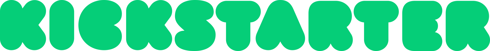

## **Project Background**

[Kickstarter](https://www.kickstarter.com/) is an online crowdfunding platform aimed at helping people get their ideas funded while building a community of fans to support their ideas. While Kickstarter publishes many advice and best-practices articles on their blog, over half of campaigns still fail.

*Why does this matter?*  

Unlike their competitor, Indiegogo, Kickstarter campaign projects follow an "all or nothing" funding model. This means that if a Kickstarter campaign fails, both the project creators are disappointed, as well as the people who did contribute because the project will not be completed in any capacity.

## **Project Objectives**

**Understand the marketplace**: Exploring the current Kickstarter markeplace, answering questions including which type of campaigns are the mainstream of the market, how to name a project and how to write description of campaigns and more.

**Provide insight**: By diving into the current attributes to figure out which attributes are more likely to make campaigns successful.

**Identify a business opportunity**: Identify a business opportunity for Kickstarter by finding campaigns just below the
predicted threshold of success and helping them get to their goal, helping both parties earn revenue.

## **Data**

### **The Data**
**Kickstarter data**: The dataset was web-scraped from kickstarter website through a scraper robot provided by webrobots website. From which I selected the most recent data on over 70, 000 Kickstarter campaigns as of November 12 2020.

  + Found [here](https://webrobots.io/kickstarter-datasets/)
* The website has a scraper robot which crawls all Kickstarter projects and collects data in CSV and JSON formats. From March 2016, The website run this data crawl once a month. 

### **The Variables** 

**Important attributes**

* Goal: amount of money that a creator needs to complete their project

* Name: name of project on Kickstarter

* Blurb: the short description displayed under the name of your project and on the browse page

* Pledged and backers: amount of money that a project has raised.

* Backers: people that have supported it at the point of the API pull

* State: successful, failed, cancelled, live or suspended

* category_parent and category: the category and its parent category the project belongs to

* Deadline: deadline given for successful funding

* state changed: state changed when campaign went to success or failure

* created at: time the project was created at

* launched at: time the project was launched at

* staff_pick: whether the project is selected and promoted by Kickstarter

* Other attributes in this dataset: country, currency, category

**Created attributes**

* name_len_clean: the length of name including stop words

* blurb_len_clean: the length of description including stop words

* Day of week and hour of the day for creation, launch and deadline date: deadline_weekday, created_at_weekday, lauched_at_weekday, deadline_hour, created_at_hour, launched_at_hour

* Days between creation and launch, and days between launch and deadline: create_to_launch, launch_to_deadline
